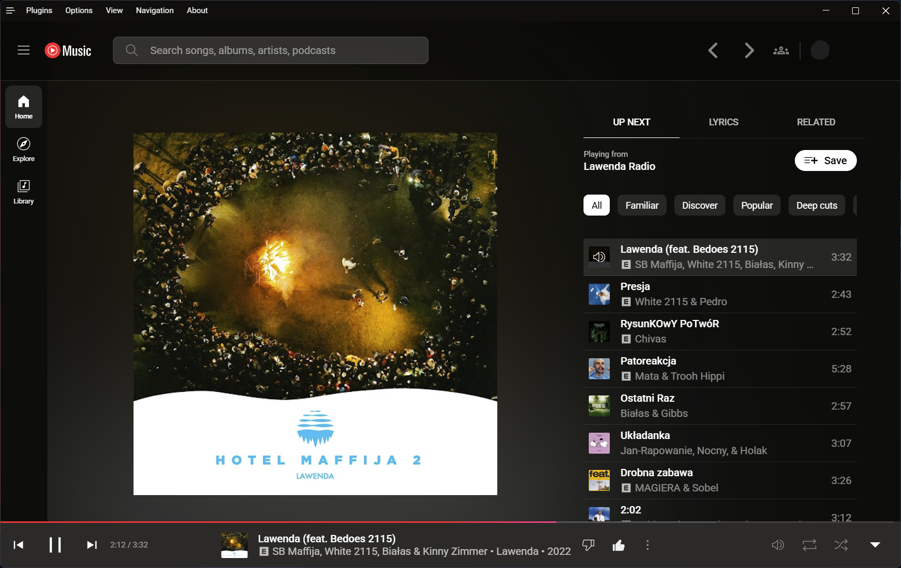
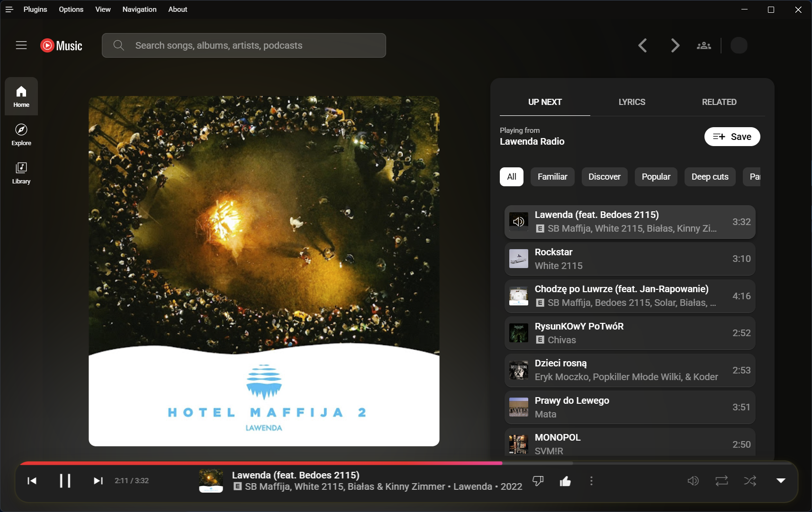

# Better YTMusic
## This project aims to make yt music better, inspired by material you
 This project is in alpha, please report any bugs and ideas for further improvements
 

tested on this version of yt desktop:
[YTM](https://github.com/th-ch/youtube-music)

<h3>How to make it work</h3>
<h4>Download style.css</h4>
<h4>Options --> Visual Tweaks --> Theme --> Import custom CSS file --> Select Downloaded file</h4>

<h3>Known issues:</h3>
All stripes (progress and volume) are rounded as much as the progress of the song / volume is in %

### Links:
[Discord](https://discord.gg/2eCpbXadsC)
<h3>Before</h3>

<h3>After</h3>

